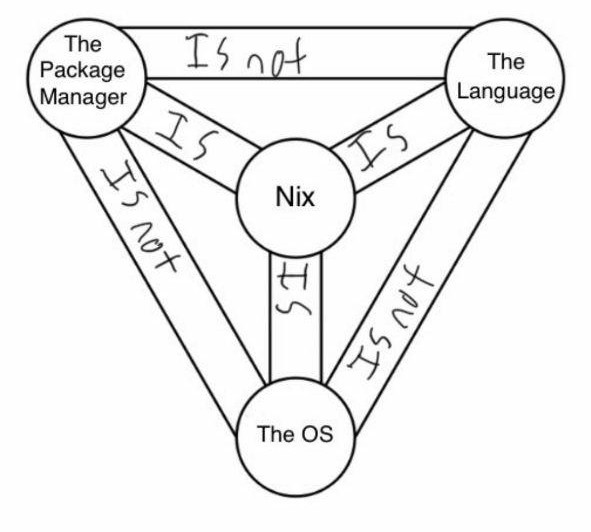

# nix 是什么

NixOS

是一个独立分支的 GNU/Linux 发行版，旨在改善系统配置管理中最先进的状态。在 NixOS 中，整个操作系统包括内核包，包括内核，应用程序，系统套件和配置文件，都是由 nix 包管理器构建。 

Nix 彼此隔离地存储所有软件包，因此没有 /bin，/sbin，/lib 和 /usr 目录，所有软件包都保存在 /nix/store 目录下。很明显，NixOS 不遵守 [FHS](https://baike.baidu.com/item/FHS/1501738?fr=aladdin)。 

Nix package manage

一个包管理器

Nix Language

一种编程语言

